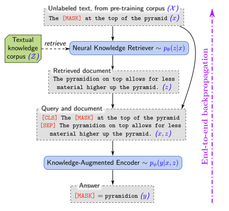
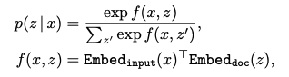
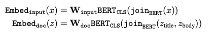

# Papers

## REALM: Retrieval-Augmented Language Model Pre-Training

### Introduction

Modern LM stores knowledge in parameters of the NN, making it difficult to determine the stored knowledge and limiting the size of NN

REALM: retrieve documents to help inform prediction, and trained throught back propogation throught a retrieval step

Reward good retrieval by modeling the approach as a ==latent variable LM== and optimizing the marginal likelihood.

Structure the retriever and selection of the best documents, so that the large-scale retrieval model could be updated.

### Approach

Objective: learn a distribution $p(y|x)$

Decomposed into two steps: retrieve $p(z|x)$ and predict $p(y|x,z)$, yielding $p(y|x)=\sum_{z\in Z}p(y|x,z)p(z|x)$, over all possible documents. 

#### Knowledge Retriever

#### Knowledge-Augmented Encoder

MLM pre-training task

## RAG: Retrieval-Augmented Generation for Knowledge-Intensive NLP Tasks

### Introduction

We explore a general-purpose fine-tuning recipe for retrieval-augmented generation (RAG) — models which combine pre-trained parametric and non-parametric memory for language generation. We introduce RAG models where the parametric memory is a pre-trained seq2seq model and the non-parametric memory is a dense vector index of Wikipedia, accessed with a pre-trained neural retriever.

### Methods

#### Models

- RAG-Sequence
  $$
  p_{sequence}(y|x)=\sum_{z\in top-k(p(·|x))}p(z|x)\Pi^N_{i}p(y_i|x,z,y_{1:i-1})
  $$

- RAG-Token
  $$
  p_{token}(y|x)=\Pi^N_{i}\sum_{z\in top-k}p(z_i|x)p(y_i|x,z_i,y_{1:i-1})
  $$

#### Retriever DPR

Use a pre-trained bi-encoder from DPR to initialize the retriever and build the document index.

Then trained to retrieve documents which contain answers to TriviaQA questions and Natural Questions.

#### Generator BART

Concatenate the input x and the retrieved document z and use BART to generate output

#### Training

Fix the document encoder, only fine-tune the query encoder and the BART generator.

#### Decoding

RAG-Token: 
$$
p'(y_i|x,y_{1:i-1})=\sum_{z\in top-k(p)}p(z_i|x)p_\theta (y_i|x,z_i,y_{1:i-1})
$$
RAG-Sequence: *TODO*

